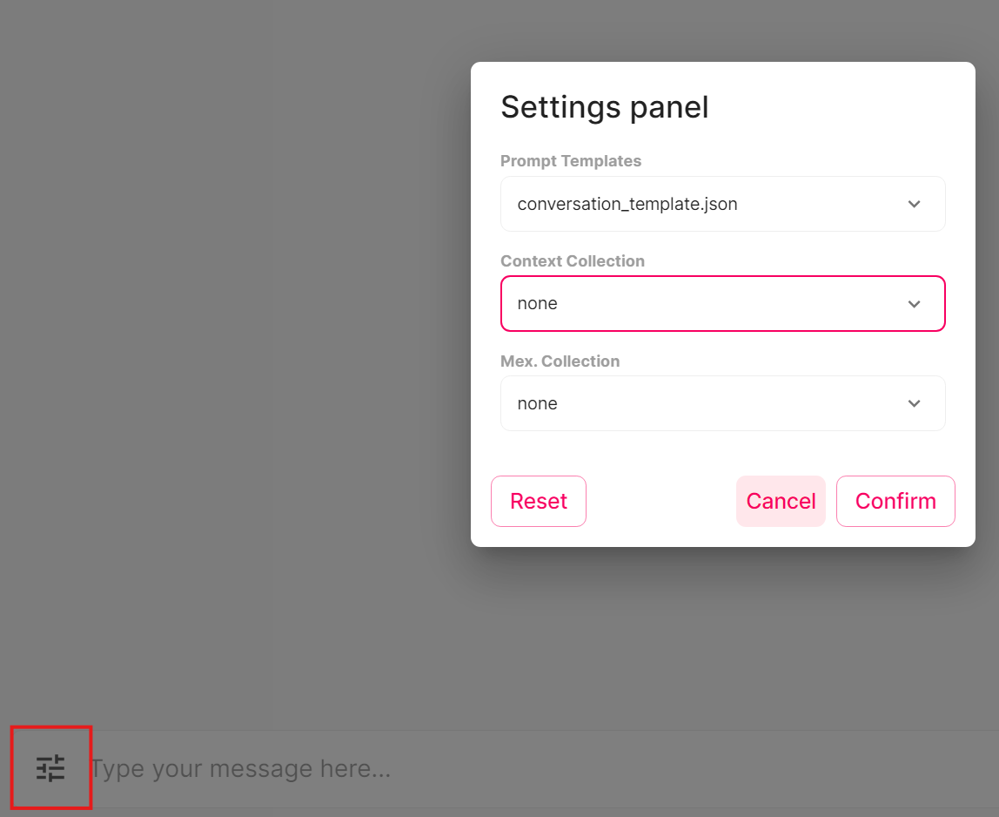

### Basic Configs
You can change the configuration settings in .env file.

The available embeddings are llama,spacy and hugginface. Make sure that the config for the chat matches the embeddings that were used to create the chroma collection. 

VECTOR_K is the value for vector storage documents for how many documents should be returned. You might need to change this based on your context and vector store chunk size. BUFFER_K is the size for conversation buffer. The prompt will include last K qustion answer pairs. Having large VECTOR_K and BUFFER_K can overfill the prompt. The default character card is Skynet_V2.png. This is just a basic template.

Config Field  | Description
------------- | -------------
MODEL_DIR     | The dir for the models
MODEL         | model_name.gguf
MODEL_TYPE    | alpaca/mistral
CHARACTER_CARD_DIR | The directory for chracter cards
CHARACTER_CARD | character_card.png/yaml/json
PERSIST_DIRECTORY | dir for chroma embeddings
PROMPT_TEMPLATE_DIRECTORY | Prompt template are stored here
REPLACE_YOU | Replace references to "You" in card with "User"
KEY_STORAGE_DIRECTORY | dir for NER keys for chroma
COLLECTION_CONFIG | Path to run config file for collection and prompt
EMBEDDINGS_TYPE | llama/spacy/hugginface
EMBEDDINGS_MODEL | spacy/hugginface model name (needs to be installed)
CUSTOM_CSS | Url to the custom css file to be used by the application.
REFINE_MODEL | Spacy model used for metadata ner parsing
REFINE_CONFIG | Ner config file used for metadata ner parsing
VECTOR_SORT_TYPE | Vector searach sort type distance/bm25/fusionrank
VECTOR_K | Fetch k closest embeddings for mmr
BUFFER_K | Buffer last k exchanges to conversation context
FETCH_K | Fetch k closest embeddings for similiarity
LAMBDA_MULT | Lambda for Chroma
LAYERS        | Number of layers to offload to gpu
SEED | Seed used for generation. Default random (-1)
N_PARTS | How many parts the model is divided into. Default auto (-1)
USE_MLOCK | Load the whole model into ram. Default False
TEMPERATURE | Adjust the randomness of the generated text (default: 0.8)
TOP_P | A higher value for top-p (e.g., 0.95) will lead to more diverse text, while a lower value (e.g., 0.5) will generate more focused and conservative text. The default value is 0.9.
REPEAT_PENALTY | The repeat-penalty option helps prevent the model from generating repetitive or monotonous text. A higher value (e.g., 1.5) will penalize repetitions more strongly, while a lower value (e.g., 0.9) will be more lenient. The default value is 1.1.
TOP_K | A higher value for top-k (e.g., 100) will consider more tokens and lead to more diverse text, while a lower value (e.g., 10) will focus on the most probable tokens and generate more conservative text. The default value is 40.
LAST_N_TOKENS_SIZE | Last n tokens to consider for penalizing repetition
USE_MMAP | Allows only the necessary parts to be loaded into memory and offloading the rest. Default false
VERBOSE | Verbose mode. Default True
ROPE_CONTEXT | Rope context for rope scaling
N_CTX | Context size default 8192
N_BATCH | Message write batch size
MAX_TOKENS | Max tokens. Default 4096

### General Configs
Other configs are found in the run_files folder. These include Webscrape configs, ner parse configs and filter configs. 

Filters folder defines the general webscrape filters to clean the documents. This file uses regex and can easily be modified to add extra filtering.

Parse_configs defines the expected csv column structure and ner type parsing. This includes noun engrams, entities, noun chunks and parse type.

Web scrape configs define the web pages fo a scrape. This is convinient if you want to scrape multiple pages.

### Run Config
The run config in run_config.json in the run_files folder defines the options for chat run settings. The run config sets the defaults for message collection, context collection and for the prompt template. The config also gives the list of alternative collection and prompt settings. These can be changed while the chat is running from the chat settings menu.

